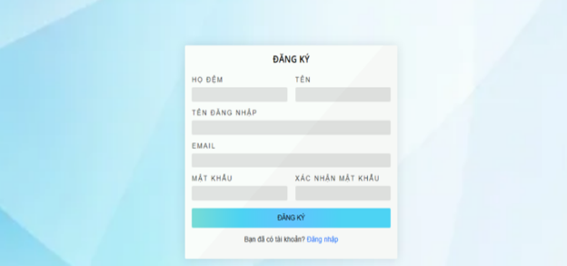
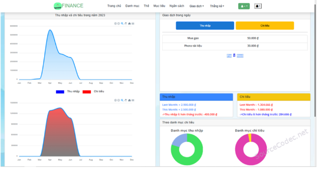

Quản lí tài chính cá nhân

Thông tin: 

- Nhóm :
  - Nguyễn Khải – 20025651
  - Nguyễn Văn Thành - 22724071
  - Lê Hữu Hưng – 22645671
- Git repository: https://github.com/KhaiNguy3n/ptud\_ExpenseTracker

Xác định yêu cầu: 

`	`1 actor: 

- User:
  - Đăng nhập, đăng kí, thay đổi password
  - Quản lý(Tạo danh mục, thêm xóa sửa các nguồn chi tiêu)

Vẽ user case diagram: 

- Chức năng:
  - Quản lí các nguồn chi tiêu và thu nhập  (nhập chi tiêu từng khoản bằng cách tạo danh mục về từng topic )
  - Đăng nhập, đăng ký thay đổi password 
  - Tính toán trung bình, tổng thu và chi hàng ngày tháng năm hiển thị báo cáo
  - Tạo dashboard visualize cho việc theo dõi dòng tiền(so sánh chi tiêu qua mỗi ngày)
  - Xuất file báo cáo excel

Thiết kế lược đồ CSDL: 

- User(name id,pass)
- Topic(Tên topic, mô tả chi tiết, thể loại[Chi tiêu,Thu nhập])
- Categories(categories id,name id, type ENUM(income,expense), description)
- Income(income id, user id, categories id,amount, DATE)
- Expense(expense id,name id, categories id, description, DATE)
## Thiết kế giao diện
Liệt kê các giao diện web (.html) cần thiết kế:

- Đăng nhập: **register.html**
- Đăng ký: **login.html**
- Trang chủ: **index.html** (hiển thị các bài post cần nhất của tất các user)
- Xuất file báo cáo pdf (preview) **previewexport.html**
- Đổi mật khẩu: **resetpass.html**

Giao diện

Kế hoạch thực hiện:

- Tuần 1: Phân tích và thiết kế
  - Xác định yêu cầu của ứng dụng 
  - Nghiên cứu các ứng dụng tương tự để tham khảo giao diện và tính năng.
  - Lập sơ đồ use case, sơ đồ ERD.
- Tuần 2 : Thiết lập môi trường và cơ sở dữ liệu
  - Chọn công nghệ phát triển.
  - Thiết lập môi trường lập trình, cài đặt thư viện cần thiết.
  - Xây dựng cơ sở dữ liệu.
- Tuần 3 : Phát triển tính năng chính
  - Xây dựng chức năng thêm/sửa/xóa giao dịch chi tiêu.
  - Hiển thị danh sách chi tiêu theo ngày/tháng.
  - Tạo biểu đồ thống kê chi tiêu.
- Tuần 4 : Hoàn thiện các tính năng bổ sung
  - Thêm tính năng phân loại chi tiêu theo danh mục.
  - Thêm tính năng nhắc nhở (nếu cần).
- Tuần 5 : Kiểm thử và tối ưu
  - Kiểm thử chức năng, sửa lỗi.
  - Cải thiện hiệu suất.
  - Điều chỉnh giao diện cho trải nghiệm tốt hơn.
- Tuần 6 : 
  - Viết tài liệu.
  - Triển khai ứng dụng.
  - Chuẩn bị báo cáo và trình bày.
